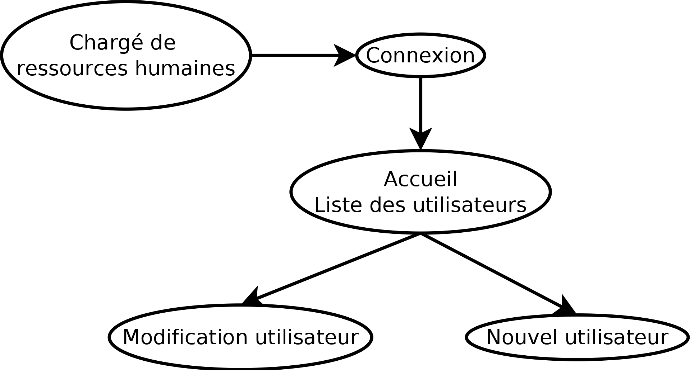
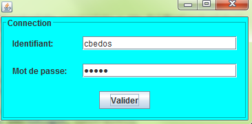
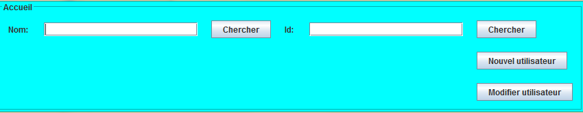
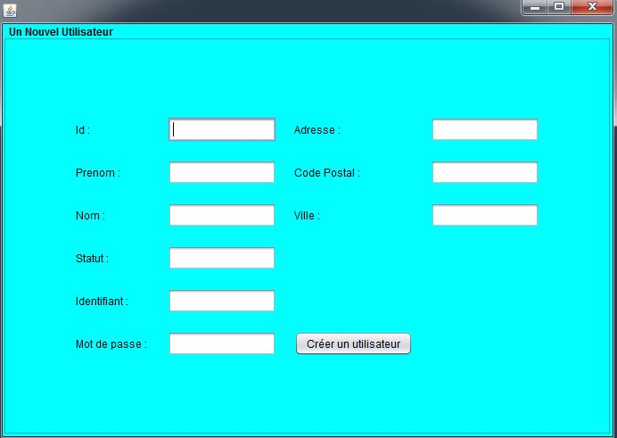

# BTSSIO2 - GestionUtilisateurs

Exercice de Projet Personnel Encadré de BTS SIO. Le sujet est conditionné avec le développement d'application pour une entreprise fictive GSB, qui gère des laboratoires et des praticiens médicales.

Le but de cette application est de permettre la modification des informations des utilisateurs. Les personnes autorisées à modifier sont au nombre de deux et font partie du service RH.

Application de gestion des utilisateurs.  Création d'une interface graphique. Les informations affiché sont distribuées par une BDD et liées via des classes spécifiques. Développé selon le modèle MVC.

[Gestion de projet](https://vcabillic.framaboard.org/?controller=BoardViewController&action=readonly&token=f3a4a1de2ef7d12a83f5c885cdc6a82a97cf1fc70605237c1a55de8cad2d)

## Configuration

Voir fichier de conf pour configurer la connexion. En spécifiant le type de base de données, l'url de la base et son nom.

[*Documentation conception et technique*](./documentation/DOC.md)

L'accès aux différents parties de l'application est comme ci-suivant :

## Visuels

**Page de connexion**

**Page d'accueil**

**Page de création de nouvel utilisateur**

