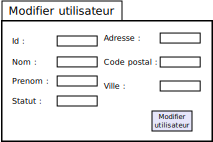

# Documentation technique et conception

## Sommaire

## Maquette des vues de l'application

Les maquettes ont été réalisées avec le logiciel [DIA](http://dia-installer.de/)

**Maquette connection**

**Maquette Accueil**

**Maquette Nouvel Utilisateur**

**Maquette Modification Utilisateur**

<<<<<<< HEAD
## Diagramme des cas d'utilisation

## Diagramme de classe
=======
>>>>>>> Doc-UnitTest
